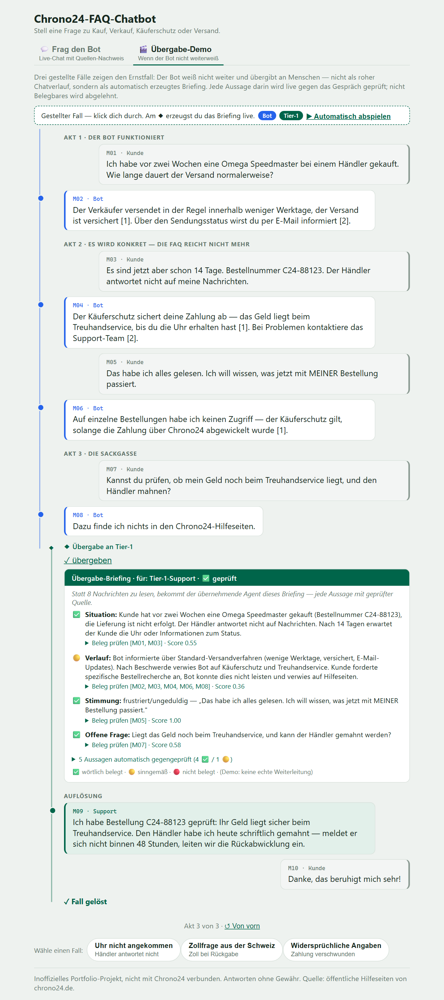
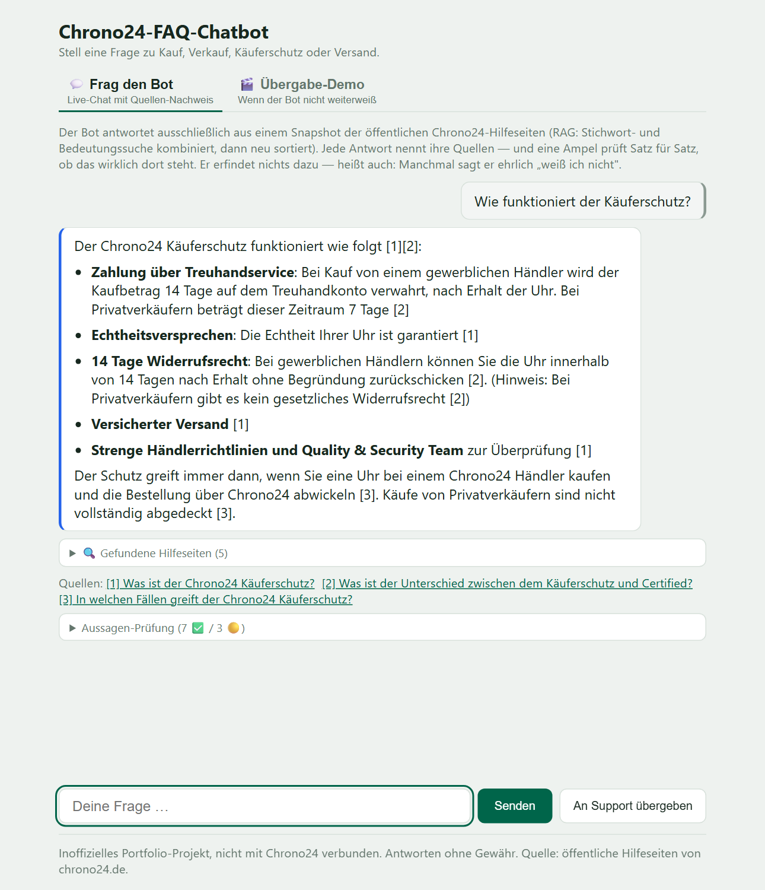

# Chrono24-FAQ-Chatbot

Ein RAG-Chatbot, der Fragen zu Kauf, Verkauf, Käuferschutz und Versand auf
Basis der öffentlichen Chrono24-Hilfeseiten beantwortet — mit Quellenangaben
und sichtbaren Retrieval-Treffern statt einer Blackbox-Antwort. Was er nicht
belegen kann, übergibt er an Menschen: als automatisch erzeugtes Briefing,
dessen Aussagen ein deterministischer Validator gegen den Chatverlauf prüft.

**Demo-Link:** folgt (Deploy steht noch aus).



**Auf einen Blick:**

- **Hybrid-Retrieval:** BM25 + Vektorsuche (Chroma), RRF-Fusion,
  Cross-Encoder-Reranker — 88 % Hit-Rate@5, held-out validiert (87 %)
- **Antworten nur aus Kontext** (Claude Haiku) mit `[n]`-Quellenangaben;
  ohne Beleg sagt der Bot ehrlich „weiß ich nicht"
- **Laufzeit-Faithfulness-Check:** jeder Antwortsatz wird deterministisch
  gegen die zitierten Quellen geprüft — Ampel im UI, kein zweiter LLM-Call
- **Handover-Briefing:** Übergabe an Menschen mit validierten Aussagen;
  Unbelegbares wird abgelehnt statt still ausgeliefert
- **Geführte Übergabe-Demo:** drei Szenarien an einer Betreuer-Zeitachse
  (Bot → Tier-1 → Tier-2), Briefing-Prüfung als sichtbare Animation,
  Kino-Modus zum automatischen Abspielen
- **Guards:** IP-Rate-Limits und globales Tages-Token-Budget

**Inhalt:**
[Architektur](#architektur) ·
[Warum Hybrid-RAG](#warum-hybrid-rag) ·
[Faithfulness-Check](#laufzeit-faithfulness-check-deterministisch) ·
[Handover](#übergabe-an-menschen-handover-briefing) ·
[Übergabe-Demo](#die-übergabe-demo) ·
[Scraping-Ethik](#scraping-ethik) ·
[Lokal starten](#lokal-starten) ·
[Tests](#tests) ·
[Guards](#guards) ·
[Deployment](#deployment-render)

## Disclaimer

Inoffizielles Portfolio-Projekt. Nicht mit Chrono24 verbunden, nicht von
Chrono24 autorisiert oder unterstützt. Antworten ohne Gewähr; Quelle ist
ausschließlich der öffentliche Hilfebereich von chrono24.de.

## Architektur

Zwei getrennte Läufe: eine lokale Offline-Pipeline baut den Index, der
Online-Service liest ihn nur noch — er scrapt zur Laufzeit nie.

```
Offline-Pipeline (lokal, einmalig bzw. bei Bedarf)
───────────────────────────────────────────────────
scraper (Playwright) → data/raw/*.html
parser               → data/corpus.json   (versioniert im Repo)
indexer              → data/index/        (Chroma + BM25, versioniert)

Online-Service (Docker)
───────────────────────────────────────────────────
Browser-Chat-UI (statisches HTML/JS, von FastAPI ausgeliefert)
   ↓ POST /api/chat (SSE-Stream zurück)
FastAPI
   ├─ Retrieval: BM25 + Vektor → RRF-Fusion → Top 5
   ├─ Claude Haiku: Antwort nur aus Kontext, mit Quellen
   └─ Guards: IP-Rate-Limit, Tages-Token-Budget
```

Der Server braucht zur Laufzeit kein Scraping und keinen Zugriff auf
Chrono24 — nur den fertigen Index aus dem Repo und den Anthropic-API-Key.
`data/corpus.json` ist ein zwischengespeicherter Snapshot öffentlicher
Chrono24-Hilfeseiten zu Demo-Zwecken, kein Live-Datenzugriff.

## Warum Hybrid-RAG

Jedes FAQ-Paar bleibt als eigenes Dokument erhalten statt in generische
Chunks zerschnitten zu werden — das erhält die Q&A-Struktur, und die
Vektorsuche embedded gezielt die Frage, nicht die Antwort, weil Nutzer:innen
selbst Fragen stellen (Frage-auf-Frage-Matching). BM25 fängt exakte
Begriffe (Produktnamen, Fachbegriffe) ab, die Embeddings manchmal
verwässern; ein RRF-Fusion aus beiden Rankings kombiniert die Stärken.

Gemessen mit einem handgeschriebenen 33-Fragen-Set (26 FAQ- und 7
Seiten-Chunk-Ziele, 3 davon englisch), iterativ verbessert — jede Stufe
wurde einzeln gemessen, auch die, die erstmal nichts bringt:

| Retrieval-Stufe | Hit-Rate@5 |
|---|---|
| Baseline: BM25 + Vektor + RRF | 76 % (25/33) |
| + Near-Duplicate-Merge der Seiten-Chunks (−5 Docs) | 73 % (24/33) |
| + Cross-Encoder-Reranker (mmarco-mMiniLMv2) über die RRF-Top-10 | **88 % (29/33)** |
| + Query-Übersetzung nicht-deutscher Fragen vor BM25 | 88 % (29/33) |
| A: `TOP_K_CANDIDATES` 10 → 25 (mehr Kandidaten fürs Reranking) | 88 % (29/33) |
| B: FAQ-Embedding auf Frage+Antwort statt nur Frage umgestellt | 82 % (27/33) |
| A+B kombiniert | 88 % (29/33) |
| **Gewinner: Status quo** (`TOP_K_CANDIDATES=10`, FAQ-Embedding = Frage) | **88 % (29/33)** |

A und A+B erreichen exakt dieselbe Trefferquote wie der Status quo, nur mit
anderer Miss-Verteilung — kein echter Gewinn, nur verschobene Fehler bei
mehr Rechenaufwand (2,5× mehr Kandidaten fürs Reranking). B verschlechtert
sich sogar: die Antwort im Embedding verwässert das gezielte
Frage-auf-Frage-Matching, das oben als Designentscheidung begründet ist.
Bei Gleichstand gewinnt laut Entscheidungsregel die einfachste Option — das
ist hier der unveränderte Status quo, also blieb Code und Index exakt wie
vor dem Experiment.

Der Dedupe-Schritt kostet solo einen BM25-Randfall, verhindert aber, dass
fast-identische Chunks die Top-5 verstopfen — zusammen mit dem Reranker
ist er neutral bis positiv. Die Query-Übersetzung ändert auf diesem Set
keinen Zähler (zwei der drei englischen Fragen trafen schon über die
multilingualen Embeddings), macht den Live-Pfad für englische Fragen aber
robust, weil BM25 sonst am deutschen Korpus vorbeiläuft. Die 4
verbleibenden Misses sind diagnostizierte harte Fälle (mehrdeutige
Zuordnung, z. B. „Certified" mit vielen nahen Kandidaten) — keine
geschönten Fragen, keine kaputte Konfidenzschwelle.

### Held-out-Validierung

Alle Zahlen oben stammen vom selben 33-Fragen-Set, das auch für jede
Tuning-Entscheidung genutzt wurde — das Risiko, unbewusst auf dieses Set hin
zu optimieren, ist real. Als Gegenprobe gibt es `eval/questions_holdout.json`:
15 neue, nie fürs Tuning verwendete Fragen zu Dokumenten, die im
Tuning-Set nicht als Ziel vorkommen (11 FAQ-, 4 Seiten-Chunk-Ziele, 2
englisch), einmalig gegen die finale Konfiguration gemessen:
**87 % (13/15)**. Das liegt nur einen Punkt unter der Tuning-Zahl (88 %) —
kein Anzeichen für Eval-Set-Overfitting, weil ein System, das nur auf die
33 Tuning-Fragen zugeschnitten wäre, auf neuen Fragen deutlich stärker
einbrechen würde.

### Antwortqualität (LLM-as-Judge)

Hit-Rate misst nur, ob der richtige Kontext gefunden wird — nicht, ob die
Antwort ihn auch korrekt nutzt. Dafür läuft `eval/judge.py` die komplette
Live-Pipeline (Query-Rewrite → Retrieval → Antwort-Streaming) für alle 33
Testfragen durch und lässt einen zweiten Haiku-Call die Antwort anhand des
tatsächlich gesehenen Kontexts bewerten: `faithful` (sind alle
Tatsachenaussagen belegt?) und `answered` (voll/teilweise/nein/verweigert).

Ergebnis des Laufs vom 21.08.2026 (33/33 Fragen, Rohdaten in
`eval/judge_results.json`):

| Metrik | Wert |
|---|---|
| Faithful-Rate | 100 % (33/33) |
| answered: voll | 27 |
| answered: teilweise | 4 |
| answered: verweigert | 2 |
| answered: nein | 0 |

Alle 4 „teilweise"-Fälle sind treu, aber unvollständig — der Kontext deckt
nur einen Teilaspekt der Frage ab (z. B. Rückgaberecht als Käufer wird
erklärt, Rückgabe durch den Verkäufer selbst fehlt im Kontext). Beide
„verweigert"-Fälle sind laut Judge korrekt: der Kontext liefert wirklich
keine Antwort auf die konkret gestellte Frage, der Bot lehnt ehrlich ab
statt zu spekulieren.

Ehrlicher Hinweis zur Methodik: Der Judge ist derselbe Modelltyp
(`claude-haiku-4-5`) wie der Chatbot selbst — gleiche Modellfamilie, damit
besteht eine milde Bias-Gefahr (der Judge könnte Fehler des Bots
systematisch übersehen, die ein anderes Modell auffangen würde). Für ein
belastbareres Signal wäre ein stärkeres oder anderes Modell als Judge
vorzuziehen; hier ist es eine bewusste Kostenentscheidung fürs Demo-Projekt.

## Laufzeit-Faithfulness-Check (deterministisch)

Der LLM-Judge misst offline; zur Laufzeit prüfte lange nichts, ob eine
Antwort wirklich durch die zitierten Quellen gedeckt ist — die Zitierpflicht
stand nur im System-Prompt. Das schließt `app/faithcheck.py`: nach jedem
Antwort-Stream wird die Antwort in Sätze zerlegt und jeder Satz per
Token-Overlap (Schwelle 0.5) gegen die zitierten `[n]`-Quellen geprüft —
deterministisch, ohne zusätzlichen LLM-Call, unbestechlich. Das Ergebnis
geht als eigenes SSE-Event ans Frontend und erscheint dort als
aufklappbares Panel „Aussagen-Prüfung" mit Ampel pro Satz: ✅ wörtlich
belegt, 🟡 sinngemäß oder ohne Zitat, 🔴 nicht gedeckt oder ungültiges
Zitat. Die Antwort wird nicht blockiert, nur transparent gemacht.



Bewusste Grenze: Token-Overlap ist ein grobes Maß — inhaltlich korrekte
Paraphrasen erscheinen gelb. Das ist Absicht: der Validator misst, statt zu
vertrauen. Derselbe Validator (gleiche Tokenisierung, gleiche Schwelle)
läuft auch im Schwesterprojekt „Handover Brief Generator" — dort
blockierend mit Retry-Logik, hier anzeigend.

## Übergabe an Menschen (Handover-Briefing)

Wenn der Bot nicht weiterweiß — oder auf Knopfdruck — übergibt er den
Chatverlauf an einen menschlichen Support-Agenten: `POST /api/handover`
lässt Claude ein strukturiertes Briefing extrahieren
(Situation/Verlauf/Stimmung/offene Frage/Claims, jede Aussage mit
Zeilen-Zitaten `M01…`), und derselbe deterministische Validator prüft jede
Aussage per Token-Overlap gegen die zitierten Chat-Zeilen. Unbelegte
Aussagen führen zu genau einem Retry mit Fehlerhinweis; scheitert auch
der, wird das Briefing **abgelehnt** statt still ausgeliefert — die
Demo-Karte sagt das offen. Der Handover-Call läuft über dieselben Guards
(Rate-Limit 3/min, Tages-Token-Budget). Damit ist die Produktstory
komplett: der Bot beantwortet, was er belegen kann; was nicht, übergibt
er an einen Menschen — mit geprüftem Briefing.

## Die Übergabe-Demo

Der Tab „Übergabe-Demo" führt die Produktstory ohne Vorwissen vor: drei
gestellte Sackgassen-Szenarien („Uhr nicht angekommen", „Zollfrage aus der
Schweiz", „Widersprüchliche Angaben"), durchklickbar in Akten. Links der
Nachrichten läuft pro Betreuer eine farbige Zeitachsen-Lane (Bot blau,
Tier-1 grün, Tier-2 bernstein) — am ◆-Meilenstein endet die alte Lane und
die Übergabe erzeugt **live** ein echtes Briefing über `POST /api/handover`.
Die Validierung ist dabei sichtbar inszeniert: jede Briefing-Zeile erscheint
erst als „wird geprüft", dann klappt das Ampel-Ergebnis mit Beleg-Zitat ein.
Nach erfolgreichem Briefing löst ein gestellter Schlussakt den Fall auf
(„✓ Fall gelöst"). Szenario 3 zeigt zusätzlich eine interne Eskalation
Tier-1 → Tier-2. Ein Kino-Modus („▶ Automatisch abspielen") spielt den
kompletten Fall inklusive Briefing selbstständig ab.

Die Chat-Verläufe der Szenarien sind gestellt und als solche markiert; die
Briefings darin sind es nicht — sie werden bei jedem Klick live erzeugt und
validiert.

## Scraping-Ethik

`robots.txt` von chrono24.de wurde vor dem Scrape-Lauf geprüft: für
`User-agent: *` ist `/info/` nicht disallowed — kein Eintrag der
Disallow-Liste erfasst `/info/*`. `Crawl-delay: 0.1` verlangt mindestens
0,1 s zwischen Requests; der Scraper hält sich an 1 Request/Sekunde, also
deutlich höflicher als gefordert. Der Lauf war ein einmaliger lokaler
Vorgang (21 Seiten, mit echtem Chrome statt headless Chromium, weil
headless auf eine Cloudflare-Challenge lief) — der deployte Server scrapt
nie, er liest ausschließlich den versionierten Index.

## Lokal starten

```bash
python -m venv .venv
.venv/Scripts/pip install -r requirements-dev.txt
# .env anlegen (siehe .env.example) und ANTHROPIC_API_KEY eintragen
.venv/Scripts/uvicorn app.main:app --port 8000
```

Danach `http://localhost:8000` im Browser öffnen.

Chroma verändert Index-Dateien unter `data/index/` schon beim bloßen Öffnen
(z. B. durch lokales Starten oder Testläufe) — solche unstaged Änderungen
mit `git restore data/index/` verwerfen, bevor committet wird.

## Pipeline neu bauen

Nur nötig, wenn sich die Chrono24-Hilfeseiten geändert haben oder der Index
neu erzeugt werden soll:

```bash
python -m pipeline.scrape && python -m pipeline.parse && python -m pipeline.index
```

Bei einem chromadb-Upgrade (Version in `requirements.txt`) muss der Index
danach neu gebaut werden — das committete Format ist an die gepinnte Version
gekoppelt.

## Tests

```bash
pytest tests/
```

Retrieval-Qualität messen:

```bash
python -m eval.run_eval
```

## Guards

Öffentliche Demo, deshalb zwei Schutzmechanismen gegen Missbrauch/Kosten:

- **Rate-Limit:** 10 Anfragen/Minute und 50 Anfragen/Tag pro IP.
- **Tagesbudget:** 200.000 Tokens/Tag global, danach liefert `/api/chat`
  `429` bis zum nächsten Tag.

Das Rate-Limit greift pro Client-IP (`get_remote_address`). Hinter einem
Reverse Proxy wie auf Render sieht uvicorn ohne Weiteres nur die
Proxy-IP — damit teilen sich dann alle Besucher:innen einen einzigen
Rate-Limit-Eimer. Deshalb läuft uvicorn dort mit
`--forwarded-allow-ips="*"` (siehe Dockerfile-`CMD`), damit es die
`X-Forwarded-For`-Adresse des Proxys übernimmt. Lokal ohne Proxy ist das
wirkungslos, weil Clients den Server dort direkt erreichen. Trade-off: der
`X-Forwarded-For`-Header ist grundsätzlich spoofbar, das Rate-Limit ist also
kein hartes Sicherheitsnetz — das globale Tagesbudget bleibt der eigentliche
Kostendeckel, unabhängig von der IP.

## Deployment (Render)

Läuft als Docker-Runtime (siehe `Dockerfile`) auf Render.

- **RAM-Bedarf:** Embedding-Modell plus Cross-Encoder-Reranker brauchen
  zusammen deutlich mehr als die 512 MB des Render-Free-Tiers — für die
  Demo ist ein Tier mit ≥ 1 GB nötig oder alternativ Hugging Face Spaces
  (Docker).

- **Env-Var:** `ANTHROPIC_API_KEY` muss gesetzt sein — ohne ihn startet der
  Service gar nicht erst (fail-fast beim Boot statt kaputter Antworten zur
  Laufzeit).
- **Health-Check-Pfad:** `/api/health`.
- **Kaltstart:** auf dem Render-Free-Tier ca. 30 s, weil der Container nach
  Inaktivität einschläft.
- **Proxy:** `--forwarded-allow-ips="*"` ist im Dockerfile-`CMD` gesetzt,
  siehe Begründung im Guards-Abschnitt oben.
- **Tagesbudget ist nicht persistent:** der Token-Zähler liegt in SQLite auf
  dem ephemeren Dateisystem des Containers und resettet bei jedem Neustart
  oder Redeploy — das Tagesbudget ist also kein verlässlicher Kostendeckel
  über einen Neustart hinweg, sondern nur innerhalb einer laufenden
  Instanz.
